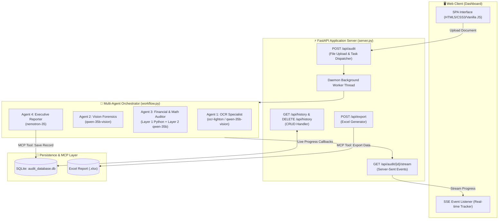
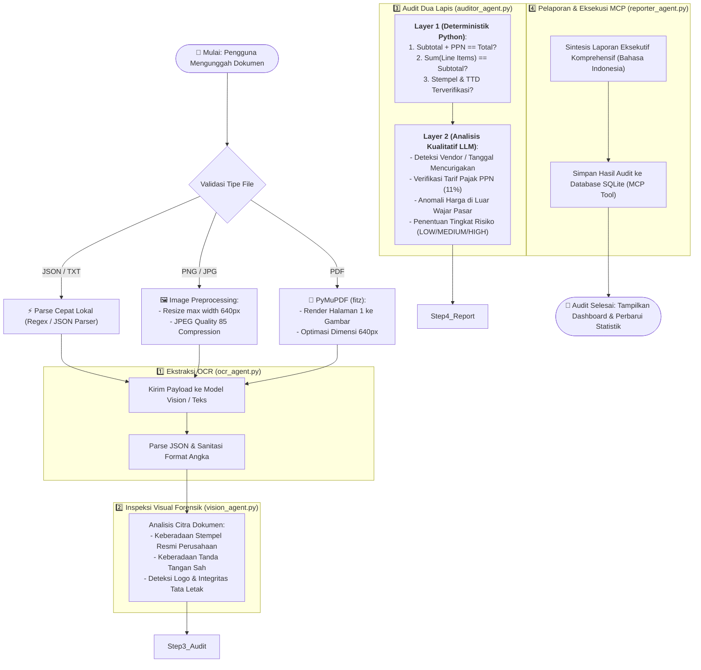

# 🧾 Enterprise Multimodal Financial Auditor

[](https://github.com/daffaarigoh/Financial_Auditor/actions/workflows/ci.yml)
[](https://www.python.org/)
[](https://fastapi.tiangolo.com/)
[](https://www.sqlite.org/)
[](https://platform.openai.com/)
[](LICENSE)

**Enterprise Multimodal Financial Auditor** adalah platform audit kepatuhan dan validasi dokumen keuangan (Invoice, Nota, Kwitansi, Laporan Keuangan) berbasis **Multi-Agent AI**. Sistem ini menggabungkan kemampuan **OCR (Optical Character Recognition)**, **Computer Vision Forensics**, **Validasi Matematika Deterministik**, serta **Deteksi Anomali & Fraud Kualitatif** menggunakan orkestrasi 4 agen AI spesialis.

---

## 📑 Daftar Isi

- [Arsitektur Sistem](#-arsitektur-sistem)
- [Alur Kerja Pipeline (Interactive Flowchart)](#-alur-kerja-pipeline-interactive-flowchart)
- [Spesialisasi Multi-Agent](#-spesialisasi-multi-agent)
- [Fitur Utama](#-fitur-utama)
- [Format Dokumen yang Didukung](#-format-dokumen-yang-didukung)
- [Panduan Instalasi & Menjalankan](#-panduan-instalasi--menjalankan)
- [Keamanan & Konfigurasi Lingkungan (.env)](#-keamanan--konfigurasi-lingkungan-env)
- [Referensi REST & SSE API](#-referensi-rest--sse-api)
- [Struktur Repositori](#-struktur-repositori)
- [Lisensi](#-lisensi)

---

## 🏛️ Arsitektur Sistem

Sistem dirancang secara modular dengan pemisahan tanggung jawab (*Separation of Concerns*):



---

## 🔄 Alur Kerja Pipeline (Interactive Flowchart)

Berikut adalah diagram alur keputusan komprehensif saat dokumen diproses oleh sistem:



---

## 🤖 Spesialisasi Multi-Agent

| Sub-Agent | Model Utama | Peran & Tanggung Jawab | Output Kunci |
|---|---|---|---|
| **Sub-Agent 1: OCR Specialist** | `ocr-lighton` *(Text)*<br/>`qwen-35b-vision` *(Visual)* | Mengekstrak data terstruktur faktur (Vendor, No. Invoice, Tanggal, Item, Subtotal, Pajak, Total). | `vendor_name`, `invoice_number`, `invoice_date`, `line_items`, `subtotal`, `tax_amount`, `total_amount` |
| **Sub-Agent 2: Vision Forensics** | `qwen-35b-vision` | Memeriksa keabsahan visual fisik dokumen, kejelasan stempel resmi, tanda tangan otentik, dan logo. | `has_company_stamp`, `stamp_quality`, `has_signature`, `signature_status`, `logo_detected`, `layout_integrity` |
| **Sub-Agent 3: Financial Auditor** | `qwen-35b` | Melakukan verifikasi matematika presisi serta deteksi anomali fraud kualitatif dan penentuan level risiko. | `math_check_passed`, `anomalies[]`, `risk_level` *(LOW/MEDIUM/HIGH)*, `tax_rate_percent`, `risk_reasoning` |
| **Sub-Agent 4: Executive Reporter** | `nemotron-35` | Menyusun laporan ringkasan eksekutif formal dan memicu penyimpanan data melalui MCP database tool. | `executive_report` *(Markdown format)*, `mcp_db_result` |

---

## ✨ Fitur Utama

- 🎨 **Dashboard Web Modern & Responsif**: Dibangun dengan Vanilla HTML5/CSS3/JS bertema *Dark Glassmorphism* yang bersih, cepat, dan intuitif.
- 📡 **Real-time Pipeline Tracking (SSE)**: Visualisasi langkah kerja tiap agen secara langsung melalui Server-Sent Events tanpa *polling*.
- 🧮 **Two-Layer Hybrid Audit**:
  - *Layer 1*: Kalkulasi matematika deterministik dengan toleransi floating-point presisi.
  - *Layer 2*: AI Deep Anomaly Reasoning untuk mendeteksi tanggal fiktif, harga *markup*, atau faktur tanpa stempel legal.
- ⚡ **Optimasi Payload Gambar**: Kompresi cerdas dan auto-resizing (640px) mencegah *API Timeout* serta menghemat bandwidth hingga 90%.
- 📜 **Manajemen Database & 1-Click Export Excel**: Dilengkapi modal riwayat audit SQLite dan fitur ekspor laporan ke `.xlsx` secara instan.
- 🛡️ **JSON Parser Tangguh**: Mengisolasi output reasoning model dan blok markdown kode secara aman tanpa risiko parsing failure.

---

## 📁 Format Dokumen yang Didukung

| Ekstensi | Tipe Dokumen | Metode Pemrosesan |
|---|---|---|
| `.json` | Faktur Terstruktur | Parsing lokal JSON instan tanpa kuota LLM |
| `.txt` | Faktur Teks / Nota TXT | Parsing *Key-Value* deterministik |
| `.png`, `.jpg`, `.jpeg` | Foto / Scan Faktur | Preprocessing citra + Vision LLM OCR |
| `.pdf` | Dokumen PDF Resmi | Rendering PyMuPDF ke visual 640px + Vision LLM OCR |

---

## 🚀 Panduan Instalasi & Menjalankan

### 1. Prasyarat Sistem
- Python 3.10 atau versi yang lebih baru.
- Akses ke endpoint LLM yang kompatibel dengan OpenAI API (misal: vLLM, Ollama, LiteLLM, atau OpenAI).

### 2. Clone Repositori
```bash
git clone https://github.com/<username-anda>/financial_auditor.git
cd financial_auditor
```

### 3. Buat Virtual Environment & Install Dependensi
```bash
# Membuat virtual environment
python -m venv venv

# Mengaktifkan virtual environment (Windows)
venv\Scripts\activate

# Mengaktifkan virtual environment (Linux/macOS)
source venv/bin/activate

# Menginstall dependensi
pip install -r requirements.txt
```

### 4. Konfigurasi Environment Variable
Salin template `.env.example` ke `.env`:
```bash
cp .env.example .env
```
Edit file `.env` dan masukkan URL API server serta API Key Anda:
```env
LLM_API_BASE=http://ip-server-anda:port/v1
LLM_API_KEY=sk-kunci-api-anda
```

### 5. Verifikasi Koneksi Model (Opsional)
Jalankan script verifikasi untuk memastikan semua model AI terhubung:
```bash
python check_api.py
```

### 6. Jalankan Pengujian Otomatis (Unit & Integration Tests)
Jalankan seluruh rangkaian test suite dengan `pytest`:
```bash
# Menggunakan pytest langsung:
pytest tests/ -v

# Atau menggunakan Makefile:
make test
```

### 7. Jalankan Aplikasi
```bash
# Menggunakan python langsung:
python server.py

# Atau menggunakan Makefile:
make run
```
Aplikasi akan berjalan pada **`http://localhost:8000`**. Buka tautan tersebut di browser Anda.

---

## 🔐 Keamanan & Konfigurasi Lingkungan (.env)

> [!IMPORTANT]
> **PENTING TENTANG KEAMANAN API KEY:**
> 
> File `.env` berisi informasi sensitif seperti URL internal dan API Key rahasia Anda. 
> Proyek ini telah mengkonfigurasi file [`.gitignore`](.gitignore) untuk **secara otomatis mengecualikan `.env`**, database `audit_database.db`, serta folder data temporer.
>
> **File yang AMAN di-push ke GitHub:**
> - [x] `.env.example` *(Hanya berisi placeholder template)*
> - [x] `requirements.txt` & `requirements-dev.txt`
> - [x] Seluruh kode program, tes (`tests/`), & file statis
> 
> **File yang OTOMATIS DIABAIKAN oleh Git:**
> - [ ] `.env` *(Kunci rahasia Anda)*
> - [ ] `data/*.db` *(Database SQLite lokal)*
> - [ ] `data/uploads/*` *(File yang diunggah saat testing)*
> - [ ] `data/reports/*` *(File Excel yang digenerate)*
> - [ ] `.pytest_cache/` & `.coverage` *(Cache hasil testing)*

---

## 🌐 Referensi REST & SSE API

| Method | Endpoint | Deskripsi |
|---|---|---|
| `GET` | `/` | Melayani antarmuka web Single Page Application (Dashboard) |
| `POST` | `/api/audit` | Menerima berkas faktur (*multipart/form-data*) dan memulai background audit |
| `GET` | `/api/audit/{job_id}/stream` | Server-Sent Events (SSE) streaming untuk memantau progres agen secara *live* |
| `GET` | `/api/history` | Mengambil seluruh daftar riwayat audit & total statistik dari database SQLite |
| `DELETE` | `/api/history` | Menghapus seluruh riwayat audit di database SQLite |
| `POST` | `/api/export` | Meng-export seluruh riwayat audit ke dalam file Microsoft Excel (`.xlsx`) |
| `GET` | `/api/models` | Memeriksa status ketersediaan model pada server LLM |

---

## 📂 Struktur Repositori

```text
financial_auditor/
├── .github/
│   └── workflows/
│       └── ci.yml             # CI/CD GitHub Actions Automated Testing Workflow
├── server.py                  # FastAPI Backend Server & Route Endpoints
├── static/
│   ├── index.html             # Antarmuka Dashboard Single Page App
│   ├── style.css              # Custom Styling (Dark Theme & Glassmorphism)
│   └── app.js                 # Logika Frontend, EventSource SSE & Fetch API
├── agents/
│   ├── workflow.py            # Orkestrator Pipeline 4 Agen
│   ├── ocr_agent.py           # Sub-Agent 1: OCR & Data Extractor
│   ├── vision_agent.py        # Sub-Agent 2: Forensik Stempel, TTD & Logo
│   ├── auditor_agent.py       # Sub-Agent 3: Validasi Matematika & Anomali
│   └── reporter_agent.py      # Sub-Agent 4: Laporan Eksekutif & MCP Caller
├── config/
│   ├── settings.py            # Konfigurasi Path, Environment & Client LLM
│   └── json_parser.py         # Ekstraktor JSON Tangguh dari Output LLM
├── mcp_tools/
│   ├── db_handler.py          # Handler Database SQLite (CRUD & Context Manager)
│   └── server.py              # Implementasi Fungsi Tool MCP (DB & Excel)
├── data/
│   ├── samples/               # Berkas Dummy Contoh Uji Coba (JSON Valid & Anomali)
│   ├── uploads/               # Direktori File yang Diunggah (Git-ignored)
│   └── reports/               # Direktori Hasil Ekspor Excel (Git-ignored)
├── tests/
│   ├── __init__.py
│   ├── conftest.py            # Fixtures Database Temp & FastAPI TestClient
│   ├── test_api.py            # Unit & Integration Test Endpoint FastAPI
│   ├── test_auditor.py        # Unit Test Validasi Matematika & Anomali
│   ├── test_db_handler.py     # Unit Test Handler Database SQLite
│   └── test_json_parser.py    # Unit Test Ekstraktor & Pembersih JSON
├── check_api.py               # Script CLI Pengecekan Ketersediaan Model
├── Makefile                   # Shortcut Perintah Developer (install, test, run, clean)
├── LICENSE                    # Lisensi Resmi MIT
├── .env.example               # Template Konfigurasi Environment Publik
├── .gitignore                 # Daftar File/Folder yang Dikecualikan dari Git
├── requirements.txt           # Dependensi Produksi
├── requirements-dev.txt       # Dependensi Pengembangan & Pengujian
└── README.md                  # Dokumentasi Resmi Proyek
```

---

## 📄 Lisensi

Proyek ini dilisensikan di bawah lisensi [MIT License](LICENSE) — silakan gunakan, kembangkan, dan modifikasi secara bebas untuk kebutuhan edukasi maupun komersial.
